# 云开发WEB示例：TodoList应用

## 前言
TodoList应用，是面向零基础同学的快速入门应用。你可以一行代码完成TodoList的本地化搭建，如果你想要网络同步你的Todo数据，在多个设备之间实时同步共享，云开发构建仅需100行。

[体验地址](https://acc.cloudbase.vip/todo/)

> 此项目适用于零基础用户体验使用，通过一定的模块手段集约了整体编码。如果想要深入学习请掌握js、html、css等编程技术，自主解析模块中的代码（均为入门原生代码）

## 一、构建本地化TodoList
在本地任意地方新建文本文件，在文件中填入如下内容：
```js
<script src="https://acc.cloudbase.vip/todo/src/todo.js" charset="utf-8"></script>
```
保存，并将后缀改为html，命名为index.html【注意：mac用户推荐使用无格式文本编辑】

使用浏览器打开此html文件，浏览器显示如下，即为正常。
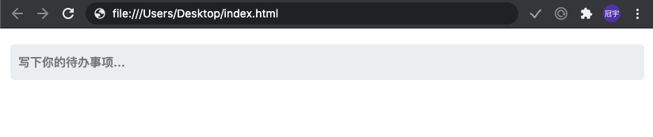
如此，你就通过一行代码完成了本地化Todo应用的构建。通过此应用，你可以回车新增一条待办，也可以以勾选已完成，修改事项内容，删除事项；当页面关闭再次加载时仍然保留待办事项。
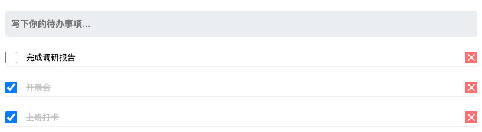

## 二、将本地TodoList发布，给其他人使用
我们只在本地构建了这个应用网站，如何将这个应用分享给其他人呢？

我们需要将这个应用网站发布到云开发静态网站托管中

打开[云开发控制台](https://console.cloud.tencent.com/tcb/env/index)，新建一个按量计费环境（如果已有按量计费环境则直接使用，跳过此步）
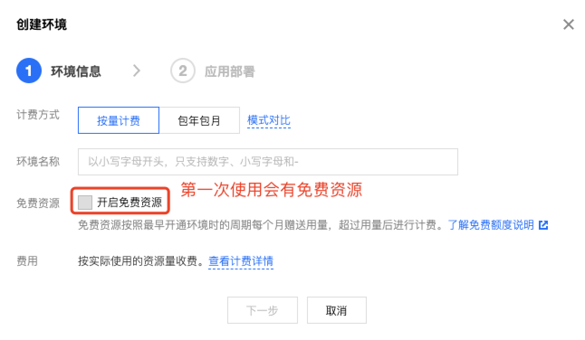

按量计费环境创建完毕后，一般自动开通静态网站托管服务，如果未开通点击开通即可。
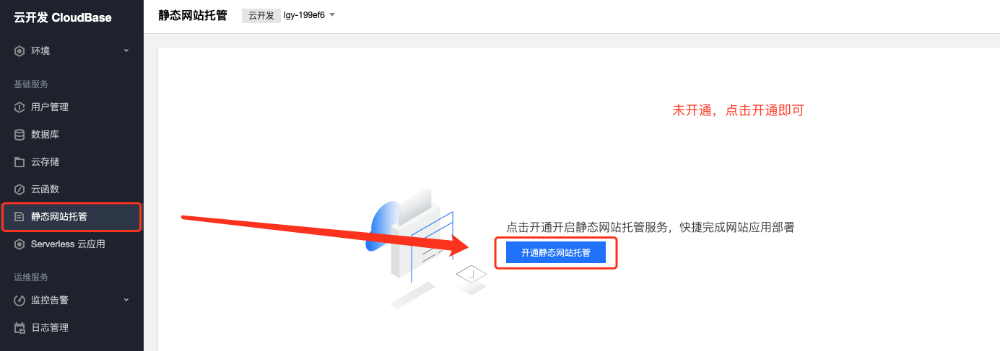
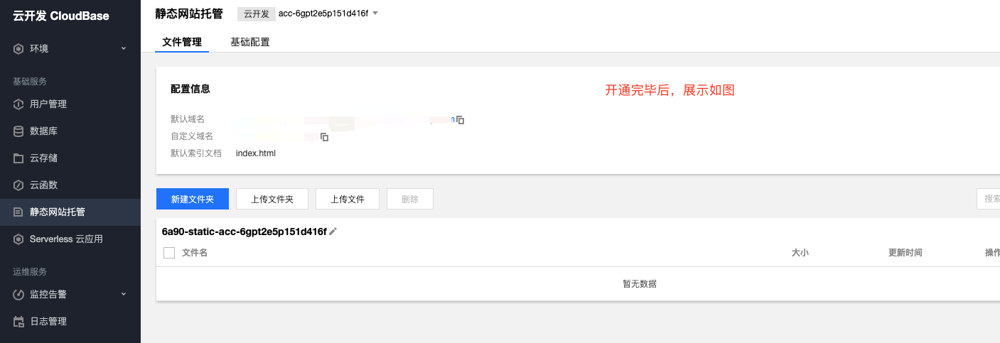

点击上传文件，将上一步的index.html选择上传
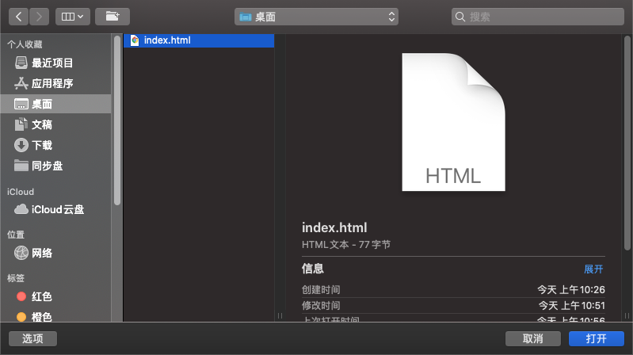
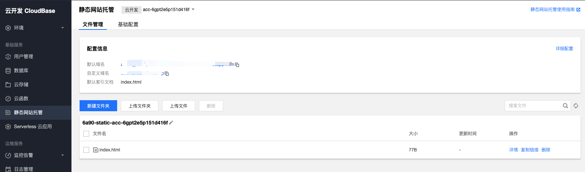

上传完毕后，点击上图配置信息中的【默认域名】，即可在公网环境下访问Todo应用网站。
> 默认域名可供您快速验证业务，如您需要对外正式提供网站服务，请绑定您已备案的自定义域名。

## 三、为Todo应用构建后台服务
以上一行代码实现的单一应用网站只能做到在本地进行Todo记录，当更换设备时，无法做到同步，接下来，我们来构建后台服务，实现同步需求。

打开[云开发控制台](https://console.cloud.tencent.com/tcb/env/index)，找到上一步操作的环境，打开数据库，新建todo集合，如下图所示：
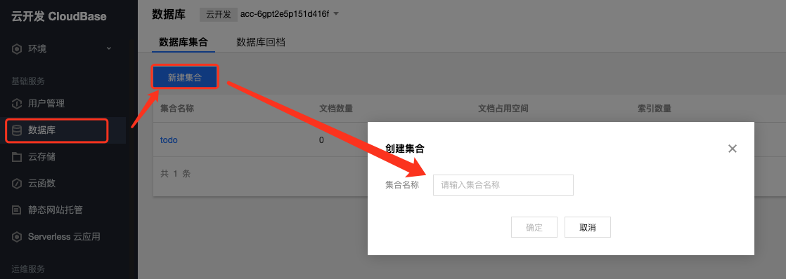

打开环境-登录授权，开启邮箱登录，如下图所示：
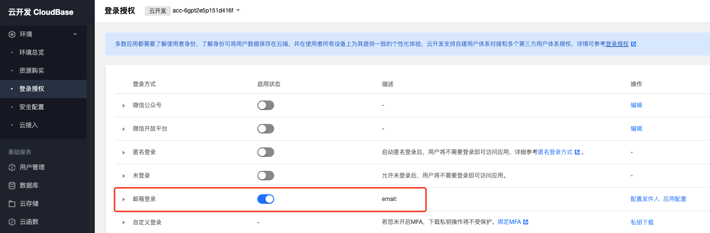

开启后点击右边【配置发件人】，参考[配置QQ邮箱](https://docs.cloudbase.net/authentication/email-login.html#shi-yong-qq-you-xiang-pei-zhi-you-xiang-deng-lu)进行配置。

随后，点击右边【应用配置】，填写一下应用名称，如下图所示
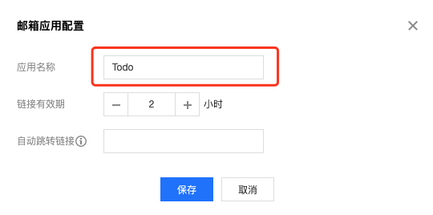

配置完成后，将你的云环境ID复制保存，填入下步骤代码中

打开之前本地构建的index.html，填充内容如下所示
```js
<script src="https://acc.cloudbase.vip/todo/src/todo.js" charset="utf-8"></script>
<script src="https://acc.cloudbase.vip/todo/src/login_util.js" charset="utf-8"></script>
<script src="https://imgcache.qq.com/qcloud/tcbjs/1.10.8/tcb.js"></script>
<script>
  let uid = null;
  const app = tcb.init({
    env: "替换自己的云开发环境ID"
  })
  const auth = app.auth({
    persistence: "local"
  });
  const db = app.database();
  window.onload = function () {
    LO.init();
    TODO.init();
  }
  LO.Done = function () {
    uid = app.auth().hasLoginState().user.uid;
    db.collection('todo').doc(uid).get().then(res => {
      if (res.data.length == 0) {
        db.collection('todo').add({
          _id: uid,
          list: TODO.todo,
          time: new Date()
        }).then(res => {
          console.log(res);
          watchtodo();
        })
      }
      else {
        console.log(res);
        TODO.todo = res.data[0].list;
        TODO.todoinit();
        watchtodo();
      }
    })
    app.callFunction({
      name:'todo_getNumber'
    }).then(res=>{
      document.getElementById('model').innerHTML+=`<p class='bottom-des'>共${res.result}人使用云开发TODO</p>`
    })
  }
  TODO.itemChange = function (id, type, des) {
    if (type === 'add') {
      if (des != null) {
        app.uploadFile({
          cloudPath: `todo/${uid}/${TODO.todo[id].file}`,
          filePath: des
        }).then((result) => {
          console.log(result)
          TODO.todo[id].file = result.fileID
          updatetodo()
        });
      } else {
        updatetodo()
      }
    } else if (type === 'delete') {
      if (TODO.todo[id].file != null) {
        app.deleteFile({
          fileList: [TODO.todo[id].file]
        }).then((result) => {
          delete TODO.todo[id]
          console.log(result)
          updatetodo()
        });
      } else {
        delete TODO.todo[id]
        updatetodo()
      }
    } else {
      updatetodo()
    }
  }
  TODO.downLoadfile = function (file) {
    app.downloadFile({
      fileID: file
    })
  }
  function updatetodo() {
    db.collection('todo').doc(uid).update({
      list: db.command.set(TODO.todo),
      time: new Date()
    }).then(res => {
    }).catch(e => {
      console.log(e);
    })
  }
  function watchtodo() {
    db.collection('todo').where({ _id: uid }).watch({
      onChange: (snapshot) => {
        if (snapshot.msgType != "INIT_EVENT") {
          TODO.todo = snapshot.docs[0].list;
          TODO.todoinit();
        }
      },
      onError: (error) => {
        alert('远端数据库监听失败！');
      }
    });
  }    
</script>
```

保存文件，重新上传至静态网站托管中，如此一个有后台服务的Todo应用便构建完成了，仍然打开配置信息中的【默认域名】（如果有缓存，可以在链接后加 **?123** 等随机数），打开后如下图所示：
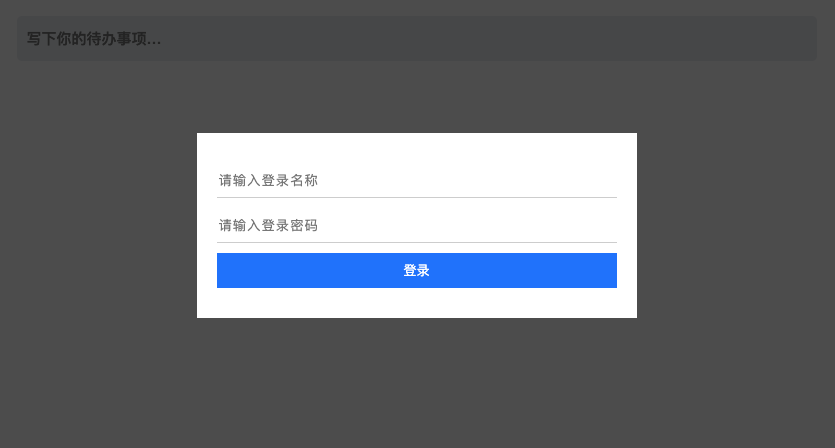

应用中引入的登录模块自动展示登录框，输入邮件地址和密码，如果未注册会直接发送注册邮件。
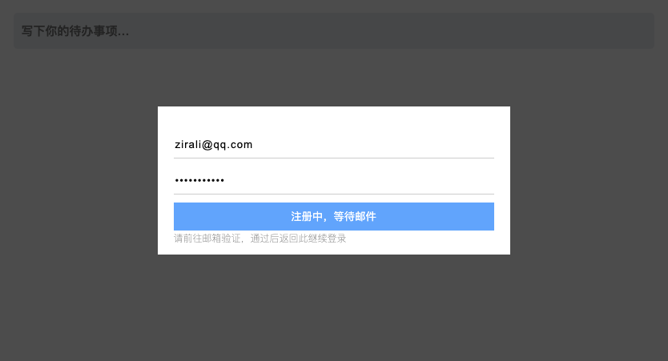

此时，前往邮箱中查看注册邮件，如下图所示：
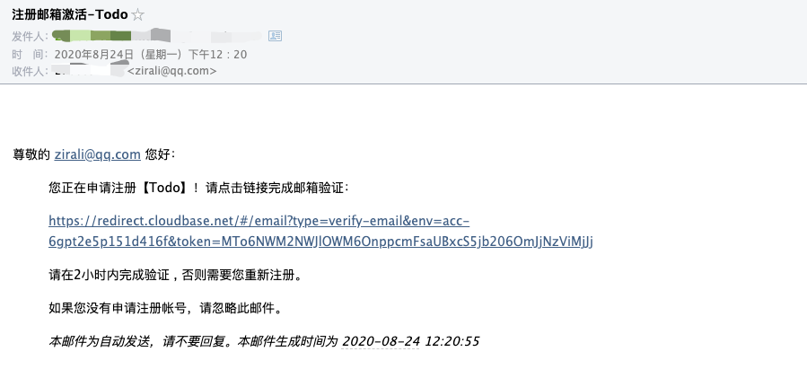

点击验证链接，将跳转到云开发验证页，验证成功后，显示如下：
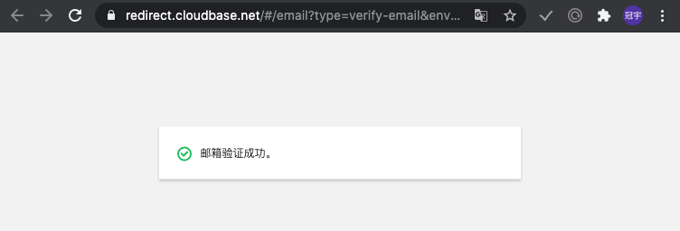

此时，返回应用网站，10s后按钮变为可点击状态，直接点击登录，即可登录成功，登录框消失。

之后，通过邮箱地址和密码即可完成之后登录。
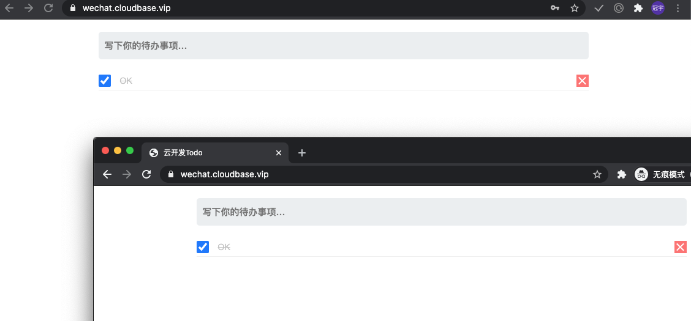

如果你想展示多少人使用TODO应用，可以将项目目录functions里todo_getNumber文件夹上传为云函数

## 写在最后

本实战项目通过模块化方式构建，直接突出云开发的开发步骤，更加直观。如果你想探寻Todo模块的内容，可以自行解压缩读代码。

login_util模块，是作者构建的一个简易登录插件，可以实现简单的登录操作，提供自定义方法，默认是云开发的邮件登录方式，所以在无自定义时请保证邮件登录配置正确并打开。

todo.js暴露接口：
```js
TODO.todo;                          //待办事项内容json，可按照规则直接改变
TODO.todoinit();                    //刷新显示待办事项
TODO.itemChange(id,type,des);       //监听待办列表变化[id，类型，描述]
TODO.downLoadfile(file)             //下载文件触发，可以在上传时修改todo列表file的值
```

login_util简易登录窗口插件，默认邮件登录，暴漏接口：
```js
  LO.custom                         //是否自定义登录方法，默认为false为邮件登录
  LO.init()                         //初始化方法调用打开登录框，默认邮件登录时则会自动判断，如果登录则触发LO.done(),不会初始化登录框
  LO.done()                         //当登录完毕时触发，默认登录时可用，自定义无效
  LO.close()                        //关闭登录框
  LO.onClose()                      //监听关闭
  LO.onLogin(obj)                   //监听登录按钮，需LO.custom=true才可生效
  LO.setBtn(text,disable)           //设置登录按钮
  LO.setDes(text,style)             //设置描述
```

作者微信：Tzirali，欢迎对云开发辅助UI模块建设作出贡献